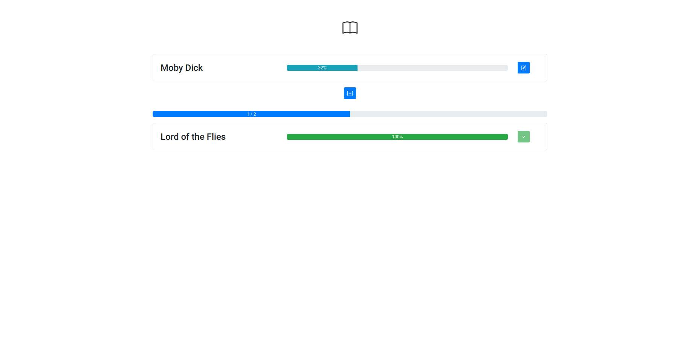

# Book Track



A book progress tracking react app to help me monitor my reading without giving my data over to other services. Basically a CRUD app with nice UI and some little extra features.

### Features
- Adding and deleting with sweet fade-in animations.
- Confetti when you finish a book.
- Project Gutenberg automatic linking when available.
- Reactive progress bars and slick UI.
- Responsive design, works well on mobile as well.

### How to run:

Locally you can run both this project and the backend. To do this you will have to install MongoDB, you don't have to create any databases but you have to launch the daemon.

```
mongod
```

Then if you want any of the operations like adding, deleting, and finishing to work you will have to also clone `book_track_backend`, [here](https://github.com/TheCynosure/book_track_backend).

```
git clone git@github.com:TheCynosure/book_track_backend.git
cd book_track_backend
PORT=8080 npm start
```

Now in a new terminal window make sure to modify the URL for the backend at the top of `src/views/Main.js` to be the port (8080) and your IP address. Then launch the frontend:

```
npm start
```

### Combining frontend and backend

To combine the frontend and backend you will have to build the frontend and then drag the build folder over into the `book_track_backend` folder. Then you can use express to serve the `build/index.html` at the root URL. This is not needed most of the time though and for casual use you should just use the above method.

### Issues

If you run into issues please feel free to open an issue or pull request. 

### Code Layout Notes

Code is all inside the src folder and is mainly inside two folders. The components folder holds all the React components that make up each page. The views folder holds each individual page. This is a bit of a misnomer as the header bar where the book appears is actually its own page. But, this was designed so that in the future it can act as a navbar when I eventually want to add a stats screen.
